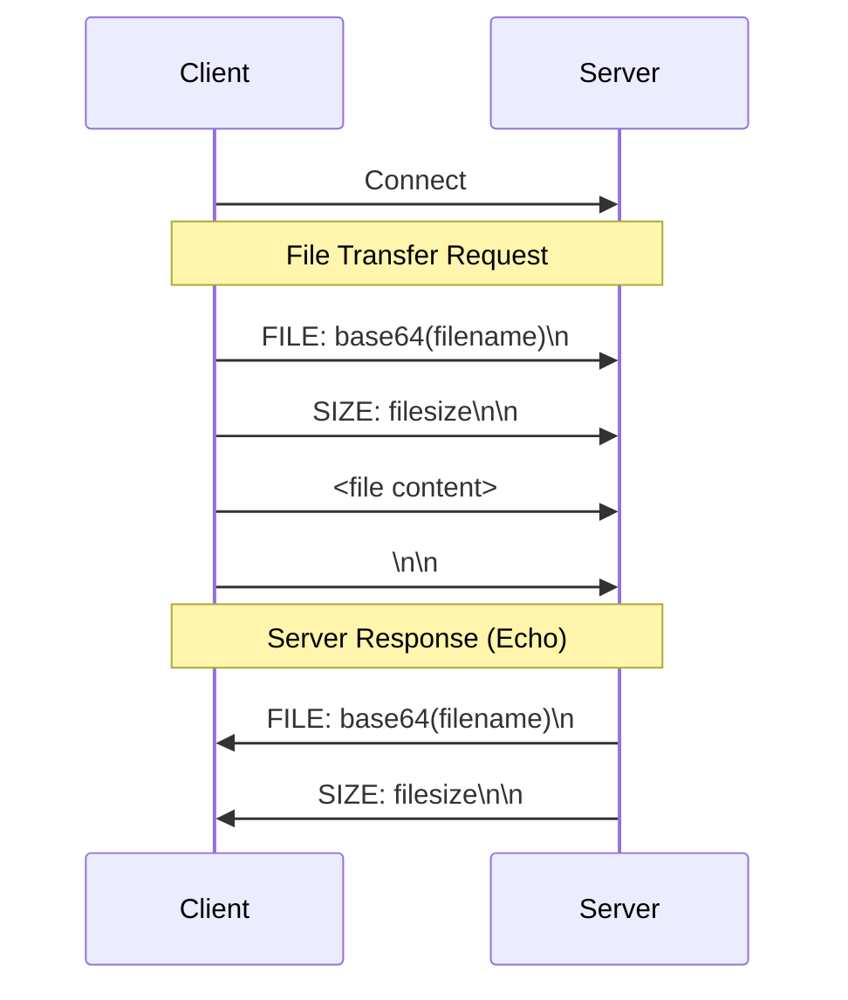

# File Transfer Protocol Report

## Overview

This document describes the custom file transfer protocol implemented in Python. The system consists of a client and a server that communicate over TCP sockets to transfer files reliably.

## Protocol Specification

The protocol uses a custom header format to exchange file metadata (name and size) before transferring the actual file content.

### Message Format

1. **File Name Header**: `FILE: <base64_encoded_filename>\n`
2. **File Size Header**: `SIZE: <file_size_in_bytes>\n\n`
3. **File Content**: Raw bytes of the file.
4. **Terminator**: `\n\n`

### Sequence Diagram

## Implementation Details

- **Language**: Python 3
- **Transport**: TCP Sockets
- **Encoding**: Base64 for filenames to ensure safe transmission of arbitrary names.

## Bugs Fixed by Gemini 3 Pro / Copilot

During the development process, the following issues were identified and resolved by the AI assistant:

1. **Protocol Header Mismatch**: The client was incorrectly sending the `FILE_NAME` tag instead of `FILE_SIZE` for the size header. This was corrected to ensure the server parses the size correctly.
2. **Response Parsing Error**: The client's response parsing logic was off-by-one in counting newline separators. The `readline()` call consumes one newline, so the subsequent check was adjusted to expect only one remaining newline instead of two.
3. **Server Buffer Flushing**: The server was writing to a buffered stream but failing to `flush()` before closing or returning, leading to `ConnectionResetError` on the client side. An explicit flush was added.
4. **Server Read Logic**: The server's use of `readlines(2)` for consuming terminators was unreliable. It was replaced with a strict `read(2)` to ensure exactly two bytes (newlines) are consumed.
5. **Busy Loop Debugging**: Added `atexit` and signal handlers (`SIGTERM`, `SIGINT`) to dump stack traces, aiding in debugging potential hangs or busy loops.
6. **Server Shutdown Handling**: The server was not responding to `Ctrl+C` (SIGINT) on Windows because the blocking `accept()` call prevented the signal from being handled. This was resolved by using `select.select()` with a timeout to poll for incoming connections, allowing the main loop to check for interrupts regularly.
7. **Robust Connection Handling**: Added exception handling for `ConnectionResetError`, `ConnectionAbortedError`, and `BrokenPipeError` in the server to prevent it from crashing if a client disconnects abruptly during transfer.
