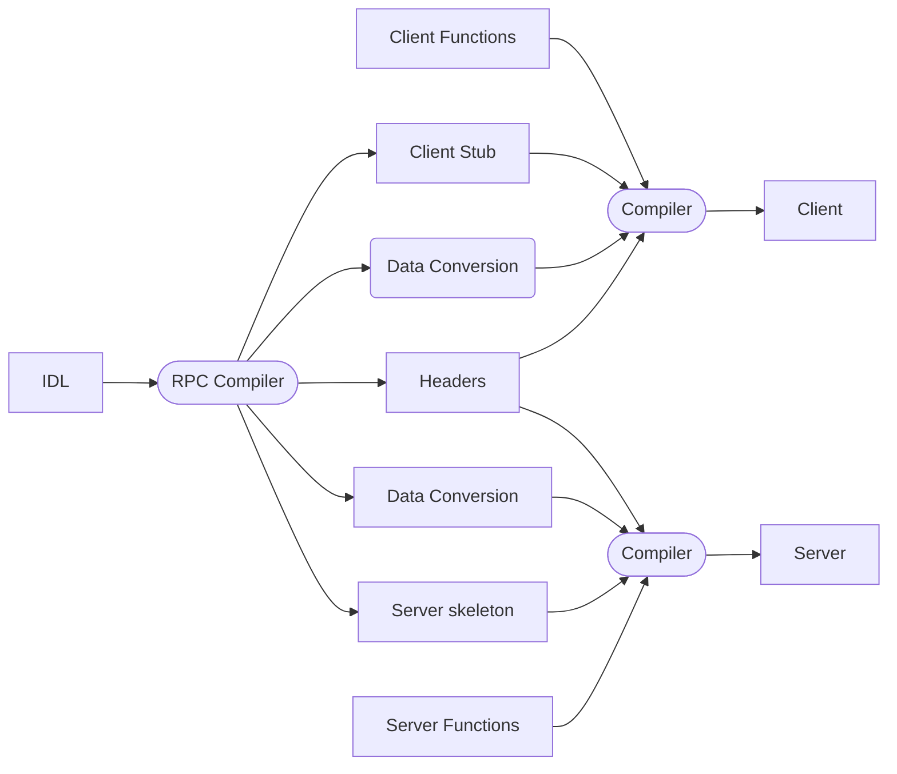

# Practical work 2: RPC File transfer

- Copy your TCP file transfer system to a new directory
called RPC
- Upgrade it to a file transfer system using RPC
  - Use any kind of RPC service
- Write a short report in ~LATEX~ markdown:
  - Name it « ~02.rpc.file.transfer.tex~ report.md »
  - How you design your RPC service. Figure.
  - How you organize your system. Figure.
  - How you implement the file transfer. Code snippet.
  - Who does what
- Work in your group, in parallel
- Push your report to corresponding forked Github repository

## ts is turning impossible

lowk

thats how MANY COMPONENTS i aint do all ts

im not nodejsing it just had a 10.0 cve im not doing that

ok WHAT THE FUCK IS THIS: <https://docs.python.org/3/library/xmlrpc.server.html#xmlrpc.server.SimpleXMLRPCServer>

wait hold ts fire
