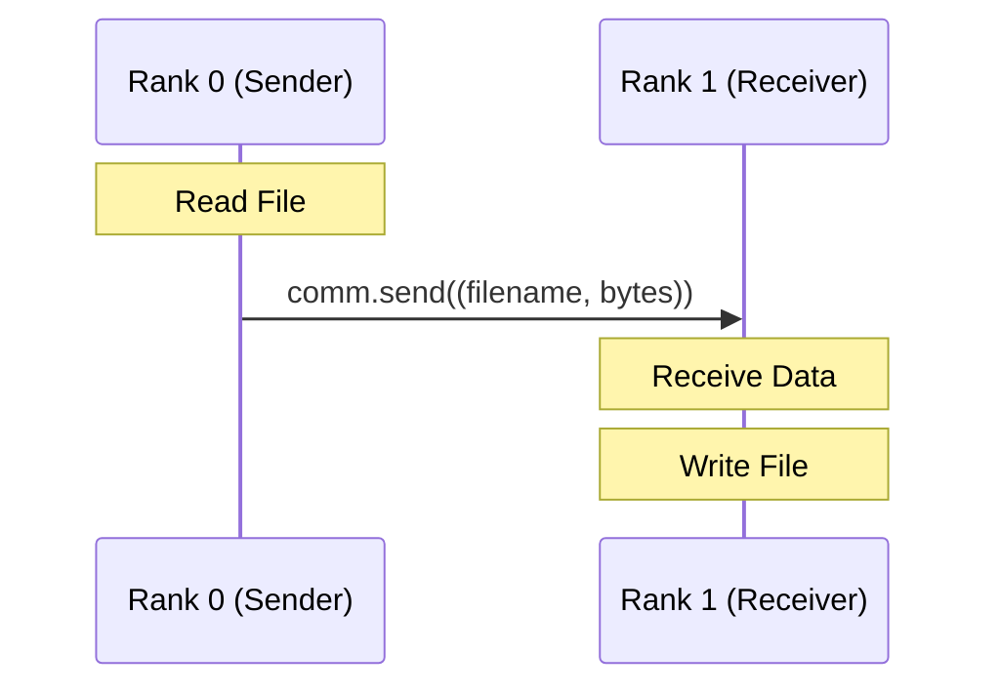

# MPI File Transfer Report

## Overview

This document details the implementation of a file transfer system using the Message Passing Interface (MPI) standard. The system leverages the `mpi4py` library to enable communication between parallel processes.

## System Design

The system uses a Single Program, Multiple Data (SPMD) model. The behavior of the program depends on the rank of the process:

- **Rank 0 (Sender)**: Reads a file from disk and sends its name and content to Rank 1.
- **Rank 1 (Receiver)**: Receives the file name and content, then writes it to disk.

### Communication Flow



## Implementation

The implementation uses `mpi4py`'s blocking point-to-point communication methods (`send` and `recv`). Python objects (tuples containing filename and binary data) are pickled and sent directly.

### Sender (Rank 0)

```python
def send_file():
    # ... (input handling)
    f = Path(file)
    # Send tuple of (name, content)
    comm.send((name, f.read_bytes()), dest=1)
    print(f"sent {f.as_posix()} as {name}")
```

### Receiver (Rank 1)

```python
def recv_file():
    # Receive tuple
    name, data = comm.recv(source=0)
    f = Path(os.path.normpath(name))
    sz = f.write_bytes(data)
    print(f"written {f.as_posix()}: {sz} bytes")
```

## Environment Setup

A significant challenge was configuring the MPI environment on Windows. To resolve this, a custom installation script (`install_env.py`) was created to automate the setup of a compatible Conda environment.

### Installation Script

The script performs the following steps:

1. Creates a new Conda environment named `uni-distrib`.
2. Installs `mpi4py` via Conda to ensure binary compatibility with the system's MPI implementation.

```python
# install_env.py snippet
run_command(f"conda create -n {ENV_NAME} python=3.12 -y")
run_command(f"conda install -n {ENV_NAME} mpi4py -y")
```

## Challenges and Fixes

### MPI Environment Issues

**Issue**: `ModuleNotFoundError: No module named 'mpi4py'` and binary incompatibilities when mixing `pip` installed `mpi4py` with Anaconda's `mpiexec`.
**Fix**: Switched to a pure Conda-based workflow. Created `install_env.py` to bootstrap a clean environment with compatible binaries.

## Team

- **Implementation**: Gemini 3 Pro / Copilot & D. A. Luong
- **Report**: Gemini 3 Pro / Copilot
