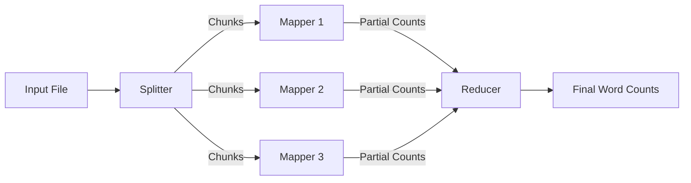

# Word Count MapReduce Report

## Overview

This document describes the implementation of a Word Count application using the MapReduce programming model. The system is implemented in Python using the `multiprocessing` module to simulate parallel processing of data chunks.

## System Design

The system follows the classic MapReduce architecture, adapted for a multi-core single-machine environment.

### Architecture Diagram



## Implementation

The implementation is divided into three main stages: Splitting, Mapping, and Reducing.

### 1. Splitting (Input Reader)

The input file is read as a stream and chunked into smaller segments based on a length limit. This avoids loading the entire file into memory, allowing the system to handle large datasets.

```python
def mapper(str_stream: Iterator[str], len_limit: int) -> Iterator[str]:
    # ... (accumulates lines until len_limit is reached)
    if counter >= len_limit:
        yield "".join(temp)
```

### 2. Mapping (Worker)

The `process` function acts as the Mapper. It takes a text chunk, tokenizes it using regular expressions, and returns a `Counter` object containing word frequencies for that specific chunk. This effectively includes a "Combiner" step, optimizing data transfer.

```python
def process(someLines: str) -> Counter[str]:
    return Counter(re.findall(r"\w+", someLines))
```

### 3. Reducing

The `join` function acts as the Reducer. It aggregates the partial results (list of `Counter` objects) from all mappers into a single global count.

```python
def join(counters: list[Counter[str]]) -> Counter[str]:
    return sum(counters, Counter())
```

### Parallel Execution

The `multiprocessing.Pool` is used to distribute the Map tasks across available CPU cores.

```python
with Pool(num_workers) as pool:
    map_results = pool.map(process, this)
```

## Why this Implementation?

We chose Python with `multiprocessing` because:

1. **Simplicity**: Python's `Counter` and `re` modules make text processing extremely concise.
2. **Parallelism**: The `multiprocessing` library allows us to bypass the Global Interpreter Lock (GIL) and utilize multiple CPU cores, simulating a distributed environment.
3. **Efficiency**: By streaming the file and using intermediate `Counter` objects (Combiner pattern), we minimize memory usage and inter-process communication overhead.

## Team

- **Implementation**: Gemini 3 Pro / Copilot & D. A. Luong
- **Report**: Gemini 3 Pro / Copilot
